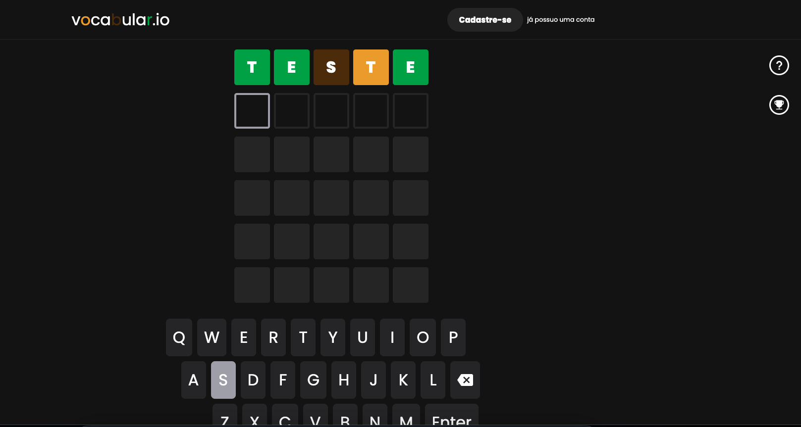

# Vocabular.io

O Vocabular.io é um projeto pessoal que visa proporcionar diversão e desafio aos jogadores através de um jogo de navegador inspirado no famoso jogo "ter.mo". O objetivo do jogo é adivinhar uma palavra de 5 letras em até 5 tentativas. O Vocabular.io foi desenvolvido utilizando as tecnologias Next.js e Styled-Components.

## Índice

- [Tecnologias Utilizadas](#tecnologias-utilizadas)
- [Capturas de Tela](#capturas-de-tela)
- [Como jogar](#como-jogar)
- [Requisitos de Instalação](#requisitos-de-instalação)

## Tecnologias Utilizadas

- Next.js: O Vocabular.io utiliza o framework Next.js para a construção da interface do usuário e a renderização no lado do servidor. Isso oferece uma experiência de jogo rápida e responsiva.
- Styled-Components: A estilização do projeto é realizada com a ajuda da biblioteca Styled-Components. Isso permite a criação de estilos dinâmicos e atraentes para os elementos da interface do jogo.

## Capturas de Tela

<div align="center">
   <h3>Página inicial</h3>
        
</div>

## Como jogar

- O jogo irá apresentar uma palavra de 5 letras, com todas as letras embaralhadas.
- Você tem até 5 tentativas para adivinhar a palavra correta.
- Digite sua tentativa na caixa de texto e pressione "Enviar".
- O jogo irá fornecer dicas sobre as letras corretas e as letras que estão no lugar certo.
- Continue adivinhando até acertar a palavra ou esgotar as tentativas.

## Requisitos de Instalação

Para executar o projeto, siga os passos abaixo:

1. Clone este repositório.
```bash
$ git clone https://github.com/ViniciusPonte/vocabular.io.git
```

2. Instale as dependencias da aplicação
```bash
$ npm i
```

3. Inicie a aplicação através dos comandos
```bash
$ npm run build
$ npm run start
``````
